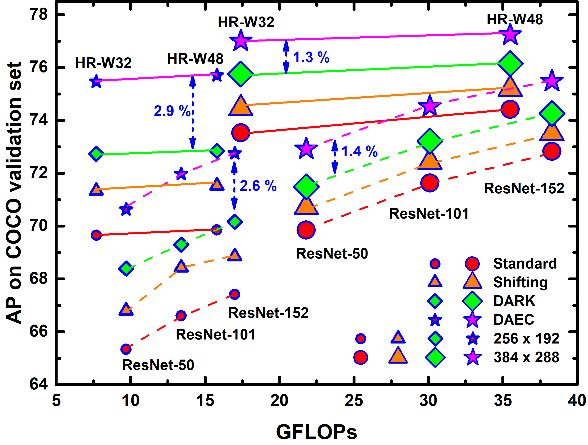
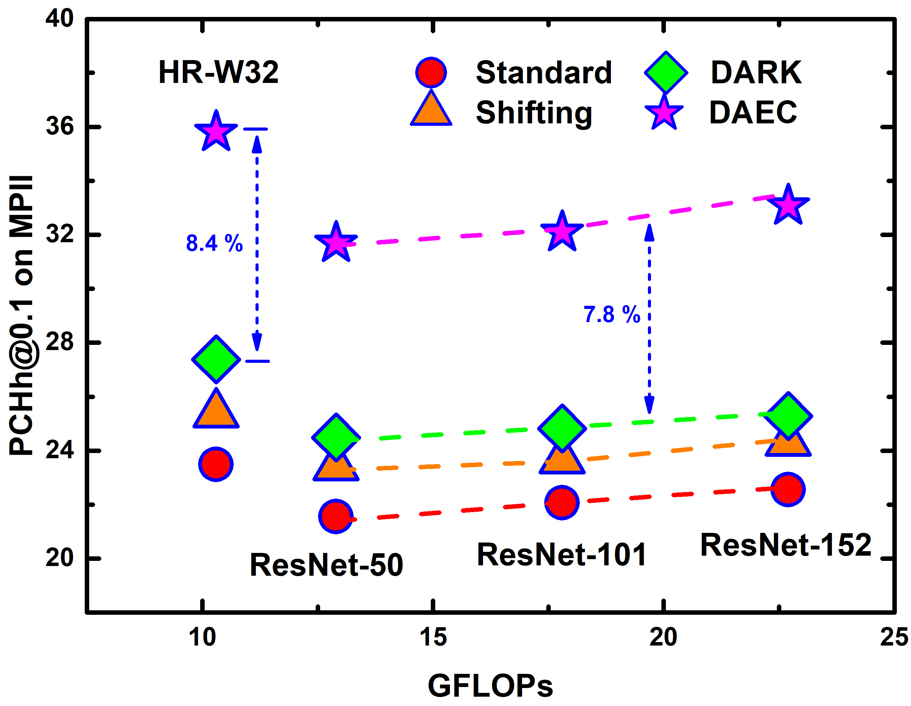

# Train Your Data Processor: Distribution-Aware and Error-Compensation Coordinate Decoding for Human Pose Estimation

<p align="center">
<b><i>Serving as a model-agnostic plug-in, DAEC significantly improves the performance of a variety of state-of-the-art human pose estimation models! </i></b>
</p>

## News
* \[2020/07/13\] Code is released.

## Introduction
&ensp; &ensp; Serving as a model-agnostic plug-in, DAEC learns its decoding strategy from training data and remarkably improves the performance of a variety of state-of-the-art human pose estimation models. Extensive experiments performed on two common benchmarks, COCO and MPII, demonstrates that DAEC exceeds its competitors by considerable margins, backing up the rationality and generality of our novel heatmap decoding idea.


 &ensp;&ensp;&ensp; 

## Main Results
### Results on COCO val2017 
| Model       | Input   | Method   | AP     | AP↑   | AP50   | AP75   | APM    | APL    | AR     | AR50   | AR75   | ARM    | ARL    |
|-------------|---------|----------|--------|--------|--------|--------|--------|--------|--------|--------|--------|--------|--------|
| ResNet\-50  | 256×192 | Standard | 65\.34 | 5\.29↑ | 90\.37 | 74\.48 | 63\.25 | 68\.59 | 69\.32 | 91\.85 | 77\.96 | 66\.57 | 73\.48 |
| ResNet\-50  | 256×192 | Shifting | 66\.80 | 3\.83↑ | 90\.43 | 75\.74 | 65\.15 | 70\.28 | 70\.84 | 91\.99 | 78\.90 | 68\.09 | 75\.00 |
| ResNet\-50  | 256×192 | DARK     | 68\.40 | 2\.24↑ | 91\.38 | 76\.89 | 66\.60 | 71\.59 | 72\.01 | 92\.07 | 79\.72 | 69\.30 | 76\.14 |
| ResNet\-50  | 256×192 | **DAEC**     | **70\.63** |        | **91\.40** | **78\.17** | **68\.27** | **74\.66** | **74\.11** | **92\.24** | **80\.81** | **70\.98** | **78\.85** |
| ResNet\-50  | 384×288 | Standard | 69\.85 | 3\.07↑ | 91\.46 | 77\.07 | 66\.86 | 74\.66 | 73\.28 | 92\.48 | 79\.83 | 69\.55 | 78\.80 |
| ResNet\-50  | 384×288 | Shifting | 70\.71 | 2\.21↑ | 91\.47 | 78\.01 | 67\.45 | 75\.55 | 73\.96 | 92\.51 | 80\.26 | 70\.18 | 79\.56 |
| ResNet\-50  | 384×288 | DARK     | 71\.49 | 1\.43↑ | 91\.47 | 78\.20 | 68\.43 | 76\.50 | 74\.71 | 92\.66 | 80\.79 | 70\.93 | 80\.35 |
| ResNet\-50  | 384×288 | **DAEC**     | **72\.92** |        | **91\.52** | **79\.41** | **69\.20** | **78\.45** | **75\.80** | **92\.87** | **81\.72** | **71\.72** | **81\.86** |
| ResNet\-101 | 256×192 | Standard | 66\.60 | 5\.38↑ | 91\.45 | 75\.77 | 65\.21 | 69\.60 | 70\.54 | 92\.46 | 78\.84 | 68\.04 | 74\.35 |
| ResNet\-101 | 256×192 | Shifting | 68\.43 | 3\.55↑ | 91\.44 | 77\.89 | 66\.77 | 71\.40 | 72\.06 | 92\.44 | 80\.05 | 69\.60 | 75\.86 |
| ResNet\-101 | 256×192 | DARK     | 69\.30 | 2\.68↑ | 91\.48 | 78\.08 | 67\.85 | 72\.60 | 73\.13 | 92\.66 | 80\.72 | 70\.66 | 76\.99 |
| ResNet\-101 | 256×192 | **DAEC**     | **71\.98** |        | **92\.48** | **79\.32** | **69\.60** | **75\.73** | **75\.31** | **93\.15** | **81\.85** | **72\.44** | **79\.73** |
| ResNet\-101 | 384×288 | Standard | 71\.63 | 2\.89↑ | 92\.44 | 80\.19 | 69\.04 | 76\.02 | 75\.07 | 93\.25 | 82\.24 | 71\.75 | 80\.12 |
| ResNet\-101 | 384×288 | Shifting | 72\.42 | 2\.10↑ | 92\.45 | 80\.25 | 69\.78 | 76\.66 | 75\.76 | 93\.26 | 82\.51 | 72\.49 | 80\.75 |
| ResNet\-101 | 384×288 | DARK     | 73\.22 | 1\.31↑ | 92\.47 | 80\.35 | 70\.70 | 77\.68 | 76\.51 | 93\.31 | 82\.97 | 73\.20 | 81\.56 |
| ResNet\-101 | 384×288 | **DAEC**     | **74\.52** |        | **92\.47** | **81\.40** | **71\.44** | **79\.40** | **77\.55** | **93\.42** | **83\.61** | **73\.97** | **82\.99** |
| ResNet\-152 | 256×192 | Standard | 67\.42 | 5\.34↑ | 91\.48 | 76\.75 | 65\.51 | 70\.85 | 71\.26 | 92\.66 | 79\.83 | 68\.63 | 75\.28 |
| ResNet\-152 | 256×192 | Shifting | 68\.86 | 3\.90↑ | 91\.52 | 77\.86 | 67\.10 | 72\.23 | 72\.60 | 92\.85 | 80\.68 | 70\.02 | 76\.55 |
| ResNet\-152 | 256×192 | DARK     | 70\.17 | 2\.59↑ | 92\.47 | 78\.93 | 68\.17 | 73\.59 | 73\.74 | 93\.03 | 81\.27 | 71\.13 | 77\.77 |
| ResNet\-152 | 256×192 | **DAEC**     | **72\.75** |        | **92\.51** | **80\.34** | **70\.00** | **76\.84** | **75\.95** | **93\.14** | **82\.68** | **72\.84** | **80\.68** |
| ResNet\-152 | 384×288 | Standard | 72\.83 | 2\.65↑ | 92\.50 | 81\.38 | 70\.24 | 76\.99 | 76\.15 | 93\.64 | 83\.50 | 72\.95 | 81\.00 |
| ResNet\-152 | 384×288 | Shifting | 73\.51 | 1\.98↑ | 92\.52 | 81\.47 | 70\.96 | 77\.74 | 76\.80 | 93\.73 | 83\.80 | 73\.60 | 81\.67 |
| ResNet\-152 | 384×288 | DARK     | 74\.26 | 1\.23↑ | **92\.54** | 82\.44 | 71\.88 | 78\.63 | 77\.50 | 93\.77 | 84\.32 | 74\.34 | 82\.31 |
| ResNet\-152 | 384×288 | **DAEC**     | **75\.48** |        | **92\.54** | **82\.59** | **72\.57** | **80\.33** | **78\.50** | **93\.84** | **84\.70** | **75\.05** | **83\.75** |
| HR\-W32     | 256×192 | Standard | 69\.66 | 5\.81↑ | 92\.49 | 79\.02 | 67\.87 | 73\.16 | 73\.42 | 93\.77 | 81\.99 | 70\.79 | 77\.48 |
| HR\-W32     | 256×192 | Shifting | 71\.33 | 4\.13↑ | 92\.49 | 81\.11 | 69\.63 | 74\.68 | 74\.85 | 93\.78 | 83\.01 | 72\.21 | 78\.95 |
| HR\-W32     | 256×192 | DARK     | 72\.74 | 2\.73↑ | **92\.51** | 81\.41 | 70\.85 | 76\.57 | 76\.24 | 93\.83 | 83\.82 | 73\.46 | 80\.53 |
| HR\-W32     | 256×192 | **DAEC**     | **75\.47** |        | 93\.49 | 83\.50 | 72\.86 | 79\.52 | 78\.35 | 94\.05 | 85\.11 | 75\.26 | 83\.13** |
| HR\-W32     | 384×288 | Standard | 73\.53 | 3\.47↑ | 92\.54 | 82\.21 | 71\.24 | 77\.74 | 76\.94 | 93\.88 | 84\.15 | 73\.69 | 81\.92 |
| HR\-W32     | 384×288 | Shifting | 74\.45 | 2\.55↑ | 92\.54 | 82\.33 | 71\.84 | 78\.62 | 77\.69 | 93\.92 | 84\.49 | 74\.45 | 82\.66 |
| HR\-W32     | 384×288 | DARK     | 75\.75 | 1\.25↑ | **93\.55** | 83\.33 | 73\.05 | 79\.92 | 78\.71 | 94\.16 | 85\.06 | 75\.45 | 83\.72 |
| HR\-W32     | 384×288 | **DAEC**     | **77\.00** |        | 93\.54 | **83\.67** | **73\.86** | **81\.86** | **79\.71** | **94\.14** | **85\.64** | **76\.17** | **85\.13** |
| HR\-W48     | 256×192 | Standard | 69\.86 | 5\.85↑ | 92\.48 | 79\.79 | 68\.12 | 73\.31 | 73\.70 | 93\.73 | 82\.31 | 70\.90 | 77\.92 |
| HR\-W48     | 256×192 | Shifting | 71\.53 | 4\.17↑ | 92\.50 | 81\.03 | 69\.56 | 75\.05 | 75\.23 | 93\.78 | 83\.28 | 72\.38 | 79\.55 |
| HR\-W48     | 256×192 | DARK     | 72\.84 | 2\.86↑ | 92\.52 | 82\.11 | 71\.18 | 76\.36 | 76\.51 | 93\.86 | 84\.18 | 73\.70 | 80\.81 |
| HR\-W48     | 256×192 | **DAEC**     | **75\.70** |        | **93\.50** | **83\.56** | **73\.05** | **79\.92** | **78\.71** | **94\.07** | **85\.53** | **75\.44** | **83\.68** |
| HR\-W48     | 384×288 | Standard | 74\.42 | 2\.82↑ | 93\.48 | 82\.41 | 71\.72 | 78\.60 | 77\.60 | 94\.05 | 84\.65 | 74\.41 | 82\.49 |
| HR\-W48     | 384×288 | Shifting | 75\.18 | 2\.05↑ | 93\.48 | 82\.53 | 72\.54 | 79\.39 | 78\.28 | 94\.11 | 84\.93 | 75\.11 | 83\.16 |
| HR\-W48     | 384×288 | DARK     | 76\.15 | 1\.08↑ | 93\.50 | 83\.69 | 73\.59 | 80\.46 | 79\.15 | 94\.11 | 85\.67 | 75\.99 | 84\.02 |
| HR\-W48     | 384×288 | **DAEC**     | **77\.23** |        | **93\.52** | **83\.74** | **74\.15** | **82\.25** | **80\.07** | **94\.24** | **85\.97** | **76\.61** | **85\.41** |
### Note:
- Flip test is not used.

### Results on MPII validation 
| Model       | Method   | Head   | Shoul\. | Elbow  | Wrist  | Hip    | Knee   | Ankle  | PCKh0\.1 | ↑       | PCKh0\.5 | ↑     |
|-------------|----------|--------|---------|--------|--------|--------|--------|--------|----------|----------|----------|--------|
| ResNet\-50  | Standard | 96\.04 | 94\.19  | 87\.25 | 81\.34 | 86\.15 | 81\.60 | 78\.32 | 21\.55   | 10\.13↑  | 86\.99   | 0\.95↑ |
| ResNet\-50  | Shifting | 96\.04 | 94\.34  | 87\.35 | 81\.53 | 86\.41 | 81\.85 | 78\.48 | 23\.40   |   8\.28↑ | 87\.15   | 0\.79↑ |
| ResNet\-50  | DARK     | **96\.15** | 94\.53  | 87\.76 | 81\.87 | 86\.76 | 82\.49 | 78\.81 | 24\.48   |   7\.20↑ | 87\.48   | 0\.47↑ |
| ResNet\-50  | **DAEC**     | 95\.87 | **94\.87**  | **88\.44** | **82\.05** | **87\.62** | **83\.22** | **79\.48** | **31\.69**   |          | **87\.95**   |        |
| ResNet\-101 | Standard | 96\.35 | 94\.62  | 87\.40 | 82\.41 | 85\.72 | 82\.35 | 78\.77 | 22\.07   | 10\.02↑  | 87\.36   | 0\.89↑ |
| ResNet\-101 | Shifting | 96\.59 | 94\.58  | 87\.69 | 82\.39 | 86\.22 | 82\.71 | 78\.98 | 23\.66   |   8\.43↑ | 87\.56   | 0\.69↑ |
| ResNet\-101 | DARK     | **96\.32** | 94\.72  | 88\.07 | 82\.85 | 86\.71 | 83\.16 | 79\.24 | 24\.82   |   7\.27↑ | 87\.85   | 0\.39↑ |
| ResNet\-101 | **DAEC**     | 96\.28 | **94\.80**  | **88\.55** | **83\.42** | **87\.54** | **83\.42** | **79\.74** | **32\.09**   |          | **88\.25**   |        |
| ResNet\-152 | Standard | 96\.62 | 95\.02  | 88\.27 | 82\.70 | 86\.38 | 83\.30 | 79\.85 | 22\.55   | 10\.52↑  | 87\.98   | 0\.80↑ |
| ResNet\-152 | Shifting | 96\.62 | 95\.31  | 88\.56 | 82\.99 | 86\.91 | 83\.58 | 79\.83 | 24\.31   |   8\.76↑ | 88\.23   | 0\.56↑ |
| ResNet\-152 | DARK     | **96\.73** | 95\.33  | 88\.80 | 83\.66 | 87\.02 | 83\.78 | **80\.63** | 25\.28   |   7\.79↑ | 88\.50   | 0\.28↑ |
| ResNet\-152 | **DAEC**     | 96\.56 | **95\.67**  | **88\.97** | **83\.85** | **87\.99** | **84\.14** | 80\.52 | **33\.07**   |          | **88\.78**   |        |
| HR\-W32     | Standard | 96\.79 | 95\.06  | 89\.08 | 84\.29 | 86\.01 | 84\.40 | 81\.39 | 23\.49   | 12\.31↑  | 88\.61   | 1\.06↑ |
| HR\-W32     | Shifting | 96\.93 | 95\.25  | 89\.06 | 84\.39 | 86\.43 | 84\.89 | 81\.58 | 25\.36   | 10\.44↑  | 88\.81   | 0\.86↑ |
| HR\-W32     | DARK     | **96\.97** | 95\.40  | 89\.57 | 85\.03 | 87\.04 | 85\.67 | 82\.03 | 27\.38   |   8\.42↑ | 89\.25   | 0\.41↑ |
| HR\-W32     | **DAEC**     | 96\.86 | **95\.58**  | **89\.98** | **85\.49** | **87\.83** | **86\.18** | **82\.59** | **35\.80**   |          | **89\.67**   |        |
### Note:
- Flip test is not used.

### Speed Comparison
|    Shifting   |      DARK    |     DAEC     |
|---------------|--------------|--------------|
| 0.31 ms/image | 3.0 ms/image | 1.4 ms/image |
### Note:
- Tested with HR\-W32-256×192 using Intel Core i7-9700F CPU
- Values are extra time cost compared with the standard decoding


## Get Started
This project is created on the basis of the [DARK](https://github.com/ilovepose/DarkPose) and [HRNet](https://github.com/HRNet/HRNet-Human-Pose-Estimation) projects. Refer to these two projects to get your datasets and models ready.


To reproduce our results, run:
```
python daec_exp/compare_decoding_modes.py > daec_exp/results/results.txt 2>&1
```

followed by:
```
python daec_exp/extract_results.py
```
then, the results are listed in file :
```
daec_exp/results/results_slim.txt
```
